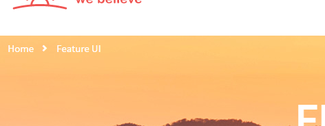

Breadcrumbs
===========

Source
~~~~~~

Sass source are in ``template_src/src/assets/sass/block/breadcrumbs.sass``

Variations
~~~~~~~~~~

*
 Default html breadcrumbs

  .. code-block:: html

     <!-- BEGIN BREADCRUMBS-->
      <nav class="breadcrumbs">
        

          <ul>
            <li class="breadcrumbs__item"><a href="" class="breadcrumbs__link">Home</a></li>
            <li class="breadcrumbs__item"><a href="" class="breadcrumbs__link">Our sermons</a></li>
          </ul>
        

      </nav>
      <!-- END BREADCRUMBS-->

*
  WP like

  .. code-block:: html

      <nav class="breadcrumbs breadcrumbs--dark">
        <ul class="breadcrumbs__list">
          <li class="home">
            
              <a title="Go to Realtyspace." href="http://realtyspace.dev" class="home">Realtyspace</a>
            
          </li>
          <li>
            
              <a title="Go to Blog." href="http://realtyspace.dev/blog/">Blog</a>
            
          </li>
          <li class="current_item">
            
              FAQ
            
          </li>
        </ul>

      </nav>