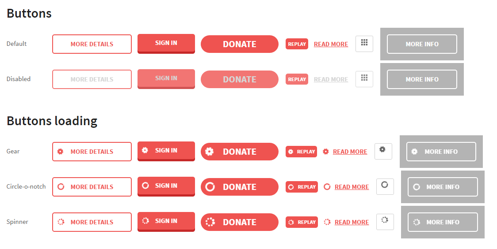

Buttons
=======

Source
~~~~~~

Sass source are in ``template_src/src/assets/sass/block/btn.sass``

Variations
~~~~~~~~~~

There are 7 button's styles:

.. code-block:: html

    <!-- Button border-brand -->
    <a class="btn--border-brand">More Details</a>
    <!-- Button Flat -->
    <a class="btn--flat">Sign In</a>
    <!-- Button flat rounded -->
    <a class="btn--flat-rounded">Donate</a>
    <!-- Button flat small -->
    <button class="btn--flat-small">Replay</button>
    <!-- Button link -->
    <a class="btn--link">Read more</a>
    <!-- Button border default -->
    <button class="btn--border-default">
    <svg class="filters__view-svg">
     <use xlink:href="#icon-grid"></use>
    </svg>
    </button>
    <!-- Button border white -->
    <a class="btn--border-white">More Info</a>

.. Note:: Modifier ``btn--loading``  will apply loading style on button. Modifiers ``btn--loading-circle-o-notch``, ``btn--loading-refresh``, ``btn--loading-spinner`` will add pretty spinner, from font-awesome collection.
