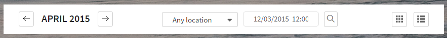

Filters
=======

Source
~~~~~~

Sass source are in ``template_src/src/assets/sass/block/filters.sass``

Example
~~~~~~~

.. code-block:: html

      

        

          <button class="btn--border-default filters__period-btn">
            <svg class="filters__period-svg">
              <use xlink:href="#icon-arrow-left"></use>
            </svg>
          </button>
          <h4 class="filters__period-label">April 2015</h4>
          <button class="btn--border-default filters__period-btn">
            <svg class="filters__period-svg">
              <use xlink:href="#icon-arrow-right"></use>
            </svg>
          </button>
        

        <!-- search -->
        

          

            <label for="in-filters-city" class="control-label sr-only"></label>
            <!--div.listing__show-wrap-->
            <select id="in-filters-city" class="form-control">
              <option>Any location</option>
              <option>New York</option>
              <option>Moscow</option>
              <option>London</option>
            </select>
          

          

            <label for="in-datetime" class="control-label sr-only"></label>
            <input type="text" id="in-datetime" value="Date" data-start-date="12/03/2015" data-end-date="12/22/2015" data-time-picker="false" data-single-picker="false" class="js-datetimerange form-control">
          

          <button class="btn--border-default filters__search-btn js-filters-btn"></button>
        

        <!-- sitch view buttons -->
        

          <button data-mode="grid" class="btn--border-default filters__view-btn js-switch-btn">
            <svg class="filters__view-svg">
              <use xlink:href="#icon-grid"></use>
            </svg>
          </button>
          <button data-mode="list" class="btn--border-default filters__view-btn js-switch-btn">
            <svg class="filters__view-svg">
              <use xlink:href="#icon-list"></use>
            </svg>
          </button>
        

      

Switch view has 2 behaviors, if is possible to change list/grid mode without reload they just change modifier class, else the page will be reloaded.

.. code-block:: js

  var $switchBtn = $('.js-switch-btn');
  var $switchView = $('.js-switch-view');
  var $switchListing = $('.js-switch-view > .listing');
  if (!$switchBtn.length || !$switchView.length ) return;

  $switchBtn.on('click', function () {
    var mode = $(this).data('mode');
    var view = $switchView.data('view');
    console.log(view);
    if (view === 'event') {
      window.location.href = 'events_' + mode + '.html';
      return;
    } else if(view === 'sermon') {
      window.location.href = 'sermons_' + mode + '.html';

    }
    var oldMode = mode === 'grid' ? 'list' : 'grid';
    $switchView.removeClass(view + '--' + oldMode);
    $switchView.addClass(view + '--' + mode);
    $switchListing.removeClass('listing--' + oldMode);
    $switchListing.addClass('listing--' + mode);
  });
