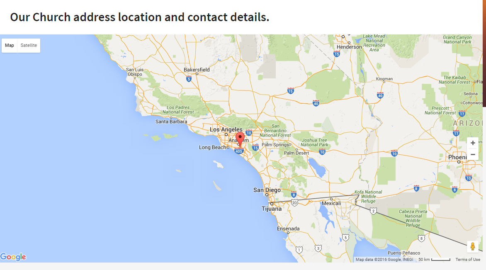

Map
===

Source
~~~~~~

| Sass styles are in folder ``template_src/src/assets/sass/widgets/map.sass`` .
| Js source are in ``template_src/src/js/module/map.js`` .

Initialize map
--------------

.. code-block:: javascript

    // .js-map-canvas - container map's
    // @param2 -  coordinates, address
    app.initMap('.js-map-canvas', {
        latitude: "33.74229160384012",
        longitude: "-117.86845207214355",
        address: "Doolittle Ave 17A, Mayflower Village, Los Angeles, CA, USA, 90185"
    });

Map html structure
------------------

.. code-block:: html

  

    

      <button type="button" class="map__change-map js-map-btn active">Property Map</button>
    

    

      

    

  

