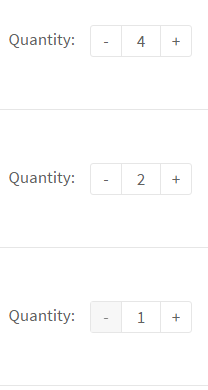

.. _numberfield:

Numberfield
===========

Source
~~~~~~

| Sass styles are in the file ``template_src/src/assets/sass/block/numberfield.sass``
| Jade sources are in ``template_src/src/jade/partials/mixins/numberfield.jade``
| Js source are in ``template_src/src/js/module/data-api/numberfield.js``

Usage
~~~~~

This widget are activated by class ``.js-numberfield``.

.. code-block:: html

  

    Quantity:
    

      <button type="button" data-type="less" class="numberfield__btn">-</button>
      <input type="text" value="1" class="numberfield__in">
      <button type="button" data-type="more" class="numberfield__btn">+</button>
    

  

